###Icon-Face(font-face)技术学imagess习记录

####1.如何将icon转为font？

---

目前我们用到的icon大多是通过Illustrator做的矢量图，那最关键的就是将设计稿中的矢量图icon完美还原成字体，这并不是很麻烦。我们可以用到一些字体编辑软件，比如FontLab，Fontograhper，Fontforge，inkscape等。这里以Fontgrapher为例.	
下载地址:
[Illustrator](http://www.skycn.com/soft/appid/21484.html)
[Fontgrapher](http://www.pc6.com/softview/SoftView_57664.html)

* 首先，设计师设计出图标的矢量图（建议都转为.ai的图像），在illustrator中打开，选中一个icon，复制

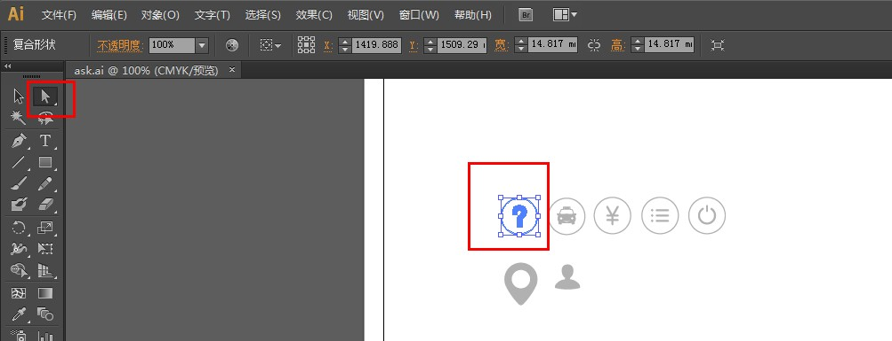

* 打开Fontgrapher，并新建一个空白字体（或者打开一个已有字体）
* 双击想要变成图标的字符（这里比方a，如果a已有字体，则选中原有字体并删除）
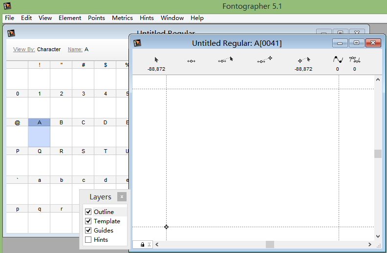
* 将在illustrator中选复制的icon，粘贴到上一步打开的a的字体栏中
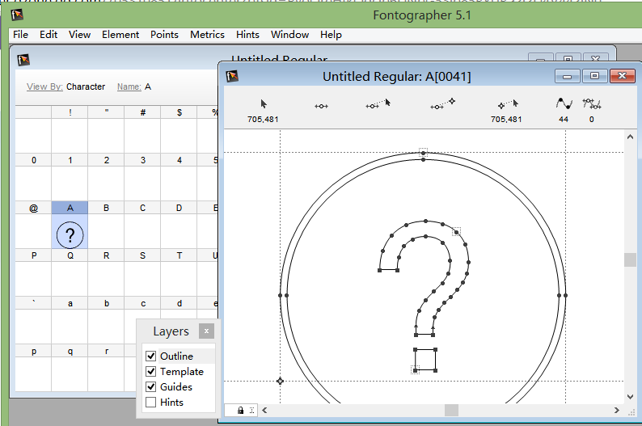
* 重复以上步骤，将你所需要的所有icon都黏贴到所需的字符编码上，并将文件导出,
File----Generate font files...
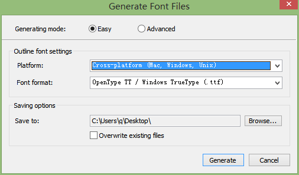
* 打开导出的.ttf格式的文件，看到我们将icon转成的font喽~~~
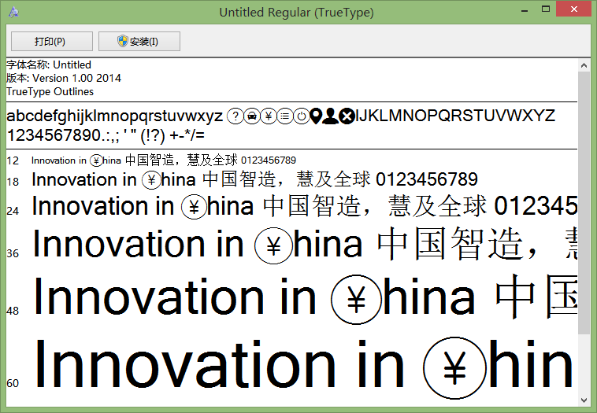

* 为了处理兼容，我们还需要**eot,svg,woff**格式的,我们需要通过下方这个网址转换格式：
[http://www.fontsquirrel.com/tools/webfont-generator](http://www.fontsquirrel.com/tools/webfont-generator)

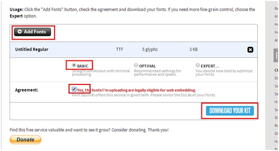

一起下载下来的，还包括demo，css，js，我们可以选择自己所需的 ttf， eot，svg，woff，
**注：通过这个网址转换的.ttf格式的文件大小，要比我们自己通过Fontgrapher生成的.fft格式的文件大小要小，所以问了减小体积，在实际应用中用转换后的.ttf格式的文件。**

* 下面我们看看这些不同格式的文件（ttf，eot,svg,woff）的兼容性吧

目前，各个浏览器对字体格式的支持是最大的区别：

1.webkit/safari：支持TrueType/OpenType(.ttf)，OpenType PS(.otf)，iOS4.2+支持.ttf，iOS 4.2以下只支持SVG字体；

2.Chrome：除webkit支持的以外，从Chrome 6开始，开始支持woff格式；

3.Firefox：支持.ttf和.otf，从Firefox 3.6开始支持woff格式；

4.Opera：支持.ttf、.otf、.svg。尚不支持woff Opera 11开始支持WOFF(多谢Apostle提醒~~)；

5.IE：只支持eot格式，IE9开始支持woff。

**注：woff是最新的web开放字体格式(web open font format)，w3c推荐，主要优势是针对浏览器进行优化，字体文件小。**

这个仅仅是其中的一种方式，我们再看看另一种方式吧~~

###2.如何将svg格式的icon转成icon_font

---

由于以上方法是修改已有的字符，这样有了局限性，下面介绍一个更强大的方法：
使用IcoMoon，他提供600+字符，您可以根据自己需求定制（如就选两个）；可以导入其他字体，也进行特别定制（类似fontforge功能）；定制字体提供打包导出功能（省去了字体转换），兼容IE6+，现代浏览器以及各类手机设备，且有demo实例，并对字符进行了HTML转化。

* 将需要svg格式的矢量图，下面提供一个网址：[http://www.iconfont.cn/](http://www.iconfont.cn/)  上面有svg，ai的图标

* 打开网址[http://icomoon.io/](http://icomoon.io/) 点击IcoMoon App

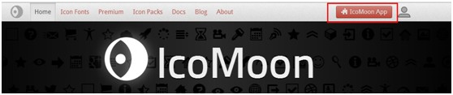

* 可以导入自己的.svg格式的矢量图，也可以选择下方提供的一些，而且可以修改他原有的icon

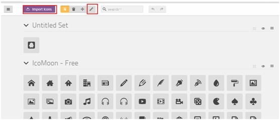

* 鼠标点击选中你要的icon,点击font

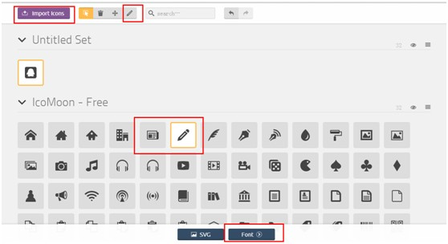

* 可以修改编码，这里面的编码，在编写css的时候会用到哦~~

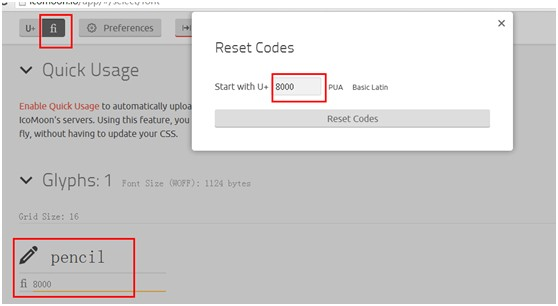

* 下载后同样会有.ttf，eot,svg,woff格式的icon_font,同时还有demo，各位按需所求
测试用7个svg的图片组成的ttf格式的大小仅有不到3k

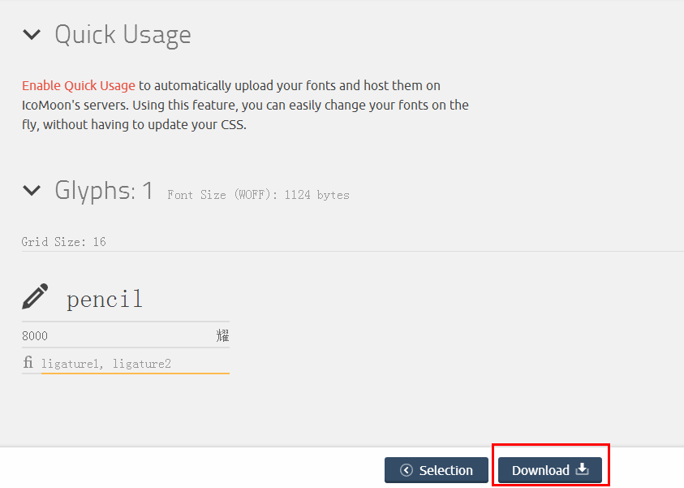

好了，icon_font已经制作完毕，下面看看怎么应用这些字体吧~~

###3.如何使用icon_font

---

	<!DOCTYPE HTML PUBLIC "-//W3C//DTD HTML 4.01 Transitional//EN" "http://www.w3.org/TR/html4/loose.dtd">
	<html lang="en">
	<head>
	<meta http-equiv="Content-Type" content="text/html;charset=UTF-8">
	<title></title>
	
	</head>
	<body>
	C
	/*在HTML里面直接写icon对应的字母就可以啦，例如改的是C这个字符*/

	
	/*就是用实际元素占位，用伪元素:before+content属性显示icon，然后覆盖到实际元素上面，之后我们修改某个icon只需要更改css样式就可以了。*/

	
	/*所有对字体操作的CSS属性都可以在这个icon_font上使用啦*/

	
	
	</body>
	</html>

4.参考网址

* [icon转webfont(矢量图转font详细，css书写讲的不详细)](http://stupig.me/tech/2012/11/27/transfer-icon-to-webfont.html)

* [CSS3 icon font完全指南](http://www.qianduan.net/css3-icon-font-guide.html)

* [讲解了两种方法](http://www.zhangxinxu.com/wordpress/2012/06/free-icon-font-usage-icomoon/)

* [Data URI](http://sjolzy.cn/What-is-the-data-URI-scheme-and-how-to-use-the-data-URI-scheme.html)

* [在手机上，Data-url和CSS Sprites哪一个更快?](http://ourjs.com/detail/532bdaea6922aa7e1d000002)

*by guofang*